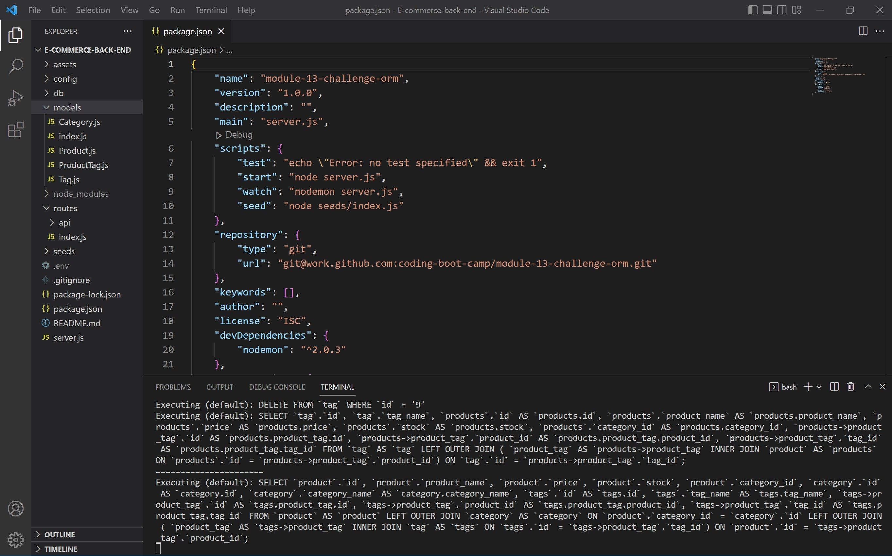
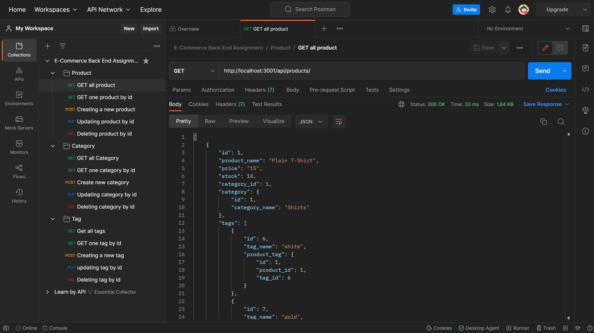

## E-commerce-back-end 

 ## Description:
 -  Build the back end for an e-commerce site.
 - This application allow users to update, view, add, and remove employees by using MYSQL, JavaScript and Node.js.

 ## Summary:
 Build an E-Commerce backend application using by Node.js, Express, JavaScript, MySQL2, Sequelize.

 ## Table of Contents:
 * [Description](#description)
 * [Summary](#summary)
 * [Visuals](#visuals)
 * [Tools](#tools-used)
 * [Usage](#usage)
 * [Installation and Database SetUp](#installation-and-database-setup)
 * [License](#license)
 * [Tests](#tests)
 * [Contact Information](#contact-information)
 * [Demostration Video](#demo)

 ## Visuals: 
 - After running "npm run start".
 

 - Demo Mockup with Postman
 

 ## Tools Used:
 - Inquirer
 - Node.js
 - JavaScript
 - MySQL2
 - Sequelize
 - Dotenv
 - Postman OR Insomnia

 <!-- ## Deployed Link on Heroku: 
 - https://tiffyalva-e-commerce-back-end.herokuapp.com/ -->

 ## Usage:
 - To use this application, install the node dependecies shown on package.json and database setup. 
 - Run the application in the terminal on VS Code,<b>"npm run start"</b>. 

 ## Installation and Database SetUp:
- To use this app npm init has to be called to create your package.json file.
- The following necessary Npm dependencies must be installed to run the application properly: Express, Dotenv, Sequelize & MySQL2.
- To properly install the database you must install MySQL on your computer, create an profile in which you have a root and a password.
- In your command line you must type <b>mysql -u root -p</b> and then enter, type your password that you created on MySQL on the following line.
- To finally add the database you must do the following: <b>source db/schema.sql</b> then enter, <b>source db/seeds.sql</b> then enter.
- Run <b>"npm run seeds"</b> on command line.

## License:

## Contributing:
- N/A

## Tests:
- N/A

## Contact Information:
* GitHub Username: <a href="https://github.com/TiffyAlva">TiffyAlva</a>
* Email: <a href="malito:TiffanyAlvarez54@gmail.com">TiffanyAlvarez54@gmail.com

## Demo:
- <a href="https://drive.google.com/file/d/1pL5TsA2uTrmZKBwzjoQIR5vFMBOZjMaQ/view?usp=share_link">Demonstration Video</a> 